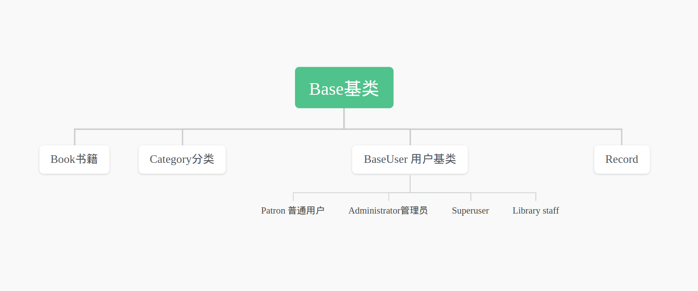

# Library MS

## 介绍
Online Library Manage System

##  环境以及技术选型
* SpringBoot 2.7.6
* mybatis-plus 3.5.1(mybatis)
* mysql8
* maven git lombok
* 数据库临时使用：
```
# 已经在application.properties中写到过
ip : 101.201.143.17  
port :3308
用户名： spmtest
密码： 123456
```
## 类设计

### 基类 Base
* id    主键
* isDelete  逻辑删
* createTime 创建时间
* updateTime 修改时间
### 书籍 Book
* name 书名
* description 简述
* author 作者
* category 分类
* isbn ISBN码
* nums 馆藏数量
* (可选) publisher 出版社
* (其他暂定...)
### BaseUser
* username 用户名
* password 密码
* name 姓名
* age 年龄
* phone 电话
* email 邮箱

### Administrator 管理员
* null

### Superuser 超级用户不知道干啥...
* null

### Patron 普通用户
* (其他...)

### Library staff 图书馆工作人员
* (...)

### category 图书分类
* name 分类名
* 还需讨论 分类几层

### Record 借书记录
* UserID 用户id
* username 用户名
* BookID 图书主键
* bookname 图书名
* flag 是否归还 0 未归还 1 已归还
* borrowTime 借书时间
* deadline 最大截至时间
* returnTime 归还时间
* fee 逾期待支付金额
